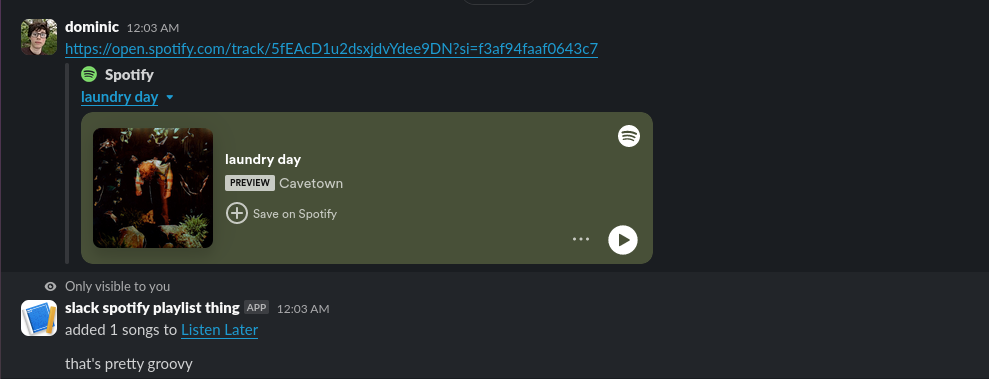
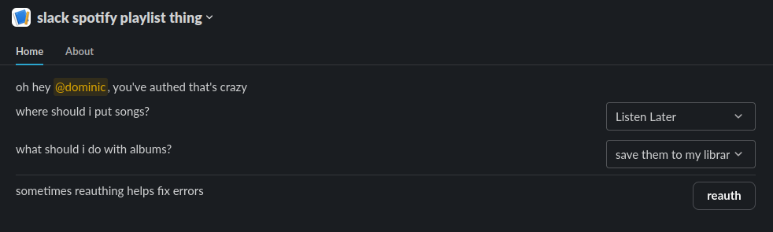

# the spotify slack playlist thing

add song recommendations from slack to a Spotify playlist, via a "message shortcut" (right-click button)




## setup

<!-- TODO -->

```sh
DATABASE_URL=
SLACK_TOKEN=
SLACK_SIGNING_SECRET=
SPOTIFY_CLIENT_ID=
SPOTIFY_CLIENT_SECRET=
ENCRYPTION_KEY= # npx cloak generate
SELF_URL=
```
